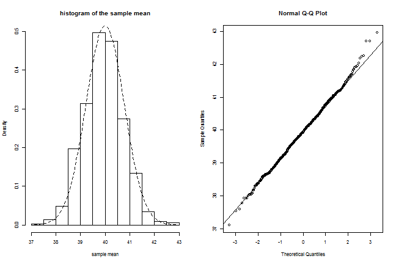

Sampling distribution of Binomial distribution
========================================================

Developing Data Products Project

Fri Apr 10 22:22:12 2015


Central Limit Theorem
========================================================

- central limit theorem (CLT) states that, given certain conditions, the arithmetic mean of a sufficiently large number of iterates of independent random variables, each with a well-defined expected value and well-defined variance, will be approximately normally distributed, regardless of the underlying distribution

- This project investigate the distribution of averages of binomial and compare it with the Central Limit Theorem.

Simulations
========================================================

We simulated 40 binomials with n=100, p=0.4 and 1000 simulations. And we can calculate the mean and variance of the sample mean as follows.


```r
set.seed(13)
num = 40; n = 100; p = 0.4; mns = NULL
for (i in 1:1000) mns = c(mns, mean(rbinom(num, n, p)))
sampleMean <- mean(mns); sampleMean
```

```
[1] 39.93792
```

```r
sampleVar <- var(mns); sampleVar
```

```
[1] 0.6497946
```

Results
========================================================

We know the theoretical mean and variance for the sample distribution are **40** and **0.6** respectively, then we can see from our simulations that the sample mean is **39.94** and **0.65**, which are very close to the theoretical values.

Next, let's check the sample distribution by looking at the histogram and comparing it with normal distribution by Q-Q plot. So from the histogram and Q-Q plot, we can tell that the sample mean is approximately normal. And this results are consistent with Central Limit Theory.


Histogram and Q-Q plot
========================================================

 
